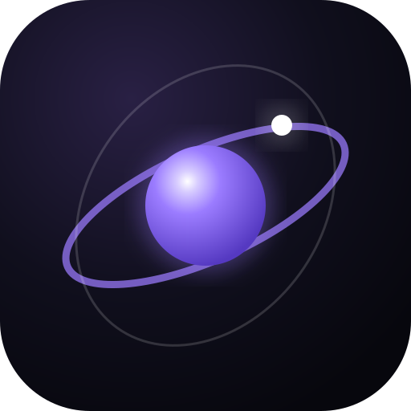
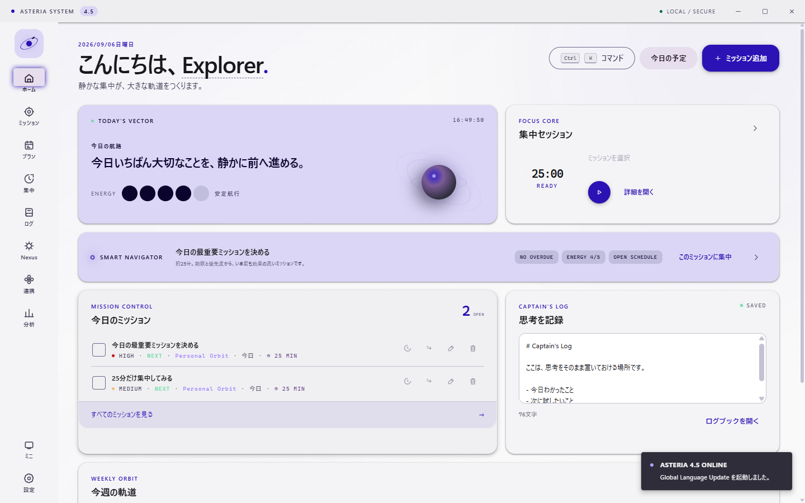
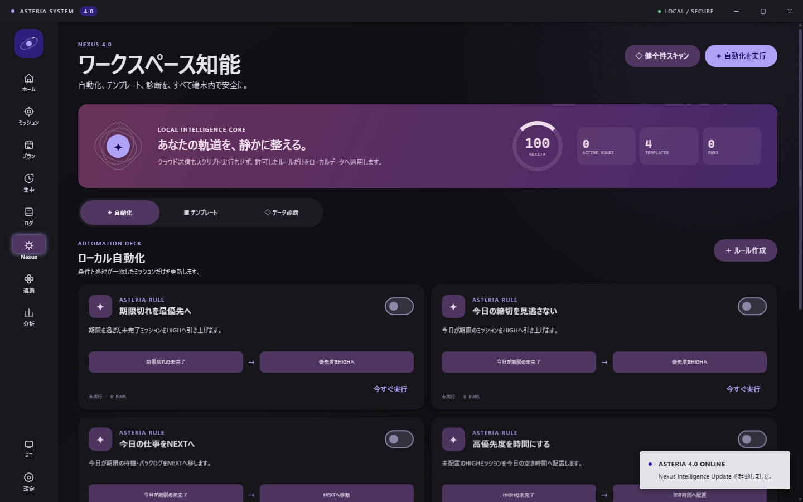
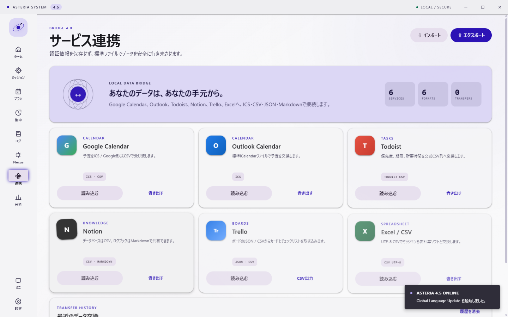

<div align="center">
  
  <h1>ASTERIA 4.5</h1>
  <p><strong>散らばった予定、ミッション、集中、記録を、ひとつの静かな軌道へ。</strong></p>
  <p>Windows向け・オフラインファーストのパーソナルコマンドセンター。</p>
  <p>
    
    
    
    
  </p>
  <p>
    <a href="https://github.com/kokonakkun/ASTERIA/releases/latest"><strong>Windows版をダウンロード</strong></a>
    · <a href="https://kokonakkun.github.io/ASTERIA/">製品ページ</a>
    · <a href="docs/guide/getting-started.md">使い方</a>
    · <a href="CHANGELOG.md">更新履歴</a>
  </p>
</div>



ASTERIAは、プロジェクト管理、今日・週・月の計画、集中タイマー、習慣、
Markdownログ、分析、データ交換を一つにまとめたWindowsデスクトップアプリです。
個人データは端末内に保存され、利用にアカウントやクラウド接続を必要としません。

> **配布版について**
> 最新版はGitHub Releasesの `ASTERIA-4.5.0-portable.exe` です。
> インストールは不要です。現在の配布版はAuthenticode未署名のため、初回起動時に
> Windows SmartScreenが警告を表示する場合があります。公開しているSHA-256と
> 照合してから実行してください。

## 4.5 — Global Language Update

ASTERIA 4.5は、表示言語をアプリ内に完全収録しました。OS言語の自動判定または設定画面から、
日本語、英語、簡体字中国語、繁体字中国語、韓国語、スペイン語、フランス語、ドイツ語、
ブラジルポルトガル語、ヒンディー語、アラビア語へ再起動なしで切り替えられます。

- オフラインで動作する11言語パックと英語フォールバック
- アラビア語のRTLレイアウト
- `Intl`による言語別の日付・数値表記
- 言語設定を含むデータスキーマ8への安全な自動移行
- Windows通知、トレイメニュー、ファイルダイアログのローカライズ
- 11言語を切り替えられる公式サイト

翻訳はローカル資産のみを使います。ユーザーのミッション、ログ、予定を外部翻訳サービスへ
送信することはありません。

## 4.0 — Nexus Intelligence Update

### ローカル知能「NEXUS」

- 条件と処理が見える、安全なローカル自動化
- 監査できる実行履歴と、直前操作のUndo
- プロジェクト・ミッション・予定をまとめて展開するテンプレート
- ミッション、予定、習慣、ログ、自動化を横断する `Ctrl+K` 検索
- 重複、参照切れ、予定衝突、期限切れ状態を見つけるデータ診断



### Material Design 3 + Spectrum

任意のアクセントカラーからセマンティックパレットを生成します。ライト、ダーク、
Windowsシステム連動に対応し、明るいカスタム色でもテキストのWCAG AAコントラストを
保つよう補正します。モーションはExpressive、Gentle、Reducedから選択できます。

### Bridge — 開かれたデータ交換

Google Calendar、Outlook Calendar、Todoist、Notion、Trello、Excelなどで使える
ローカルファイルを生成・読込できます。

| 形式 | インポート | エクスポート | 主な用途 |
|---|:---:|:---:|---|
| ASTERIA JSON | ✓ | ✓ | 完全バックアップと復元 |
| UTF-8 CSV | ✓ | ✓ | Excel、Todoist、汎用表計算 |
| iCalendar (`.ics`) | ✓ | ✓ | Google / Outlook Calendar |
| Markdown | ✓ | ✓ | Notion、ノート、長期保存 |
| Trello JSON | ✓ | — | ボードデータの移行 |

BridgeはOAuthによるライブ同期ではなく、プライバシーを優先したファイル交換層です。
ASTERIAはサービスのパスワード、トークン、クラウド認証情報を保存しません。



## クイックスタート

1. [Releases](https://github.com/kokonakkun/ASTERIA/releases/latest)から `ASTERIA-4.5.0-portable.exe` をダウンロードします。
2. 必要に応じてPowerShellでSHA-256を照合します。

   ```powershell
   Get-FileHash .\ASTERIA-4.5.0-portable.exe -Algorithm SHA256
   ```

3. EXEを任意のフォルダーに置いて起動します。個人データはWindowsのアプリデータ領域に
   保存され、直近の正常なバックアップも自動保持されます。

正しいSHA-256:

```text
3EB24089CC58026EB66538B6E904B607C379BD0AF106CF5100B390922F1C13FB
```

詳しい操作は[スタートガイド](docs/guide/getting-started.md)を参照してください。

## キーボードショートカット

| キー | 動作 |
|---|---|
| `Ctrl+K` | コマンド・ワークスペース検索 |
| `Ctrl+N` | ミッションを作成 |
| `Ctrl+Shift+N` | 時間ブロックを作成 |
| `Ctrl+Enter` | 集中タイマーを開始 / 一時停止 |
| `Esc` | 開いているオーバーレイを閉じる |

## 開発

必要環境はNode.jsとnpmです。

```powershell
npm ci
npm test
npm start
```

Windows x64向けポータブル版を生成する場合:

```powershell
npm run build:portable
```

現行版はNode単体・統合テスト **51 / 51**、Electron実機UIテストは通常画面と
最小画面（1040×680）の双方で **93 / 93** を通過しています。品質と配布検証の詳細は
[検証記録](docs/verification.md)にまとめています。

## セキュリティとプライバシー

- Electron sandboxとContext Isolationを有効化
- RendererのNode.js統合を無効化
- Content Security Policyで外部接続とオブジェクト埋め込みを遮断
- 外部ウィンドウと任意ナビゲーションを拒否
- インポート上限20 MB、CSV数式インジェクション対策
- 自動化は定義済みの安全な処理のみ。任意スクリプトを実行しない

脆弱性の報告方法は[SECURITY.md](SECURITY.md)、データ方針は
[プライバシー文書](docs/privacy.md)をご覧ください。

## English summary

ASTERIA is an offline-first personal command center for Windows. It unifies missions,
planning, focus sessions, habits, notes, insights, local automations, templates, and
interoperable file exchange in a private desktop workspace. Version 4.5 includes eleven
offline interface languages with system detection and Arabic RTL. No account is required,
and ASTERIA stores no cloud credentials or sends user content to translation services.

## License

[MIT License](LICENSE) © 2026 ASTERIA Studio
